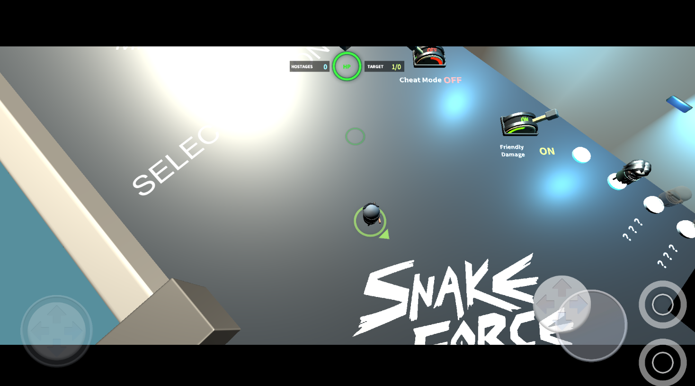
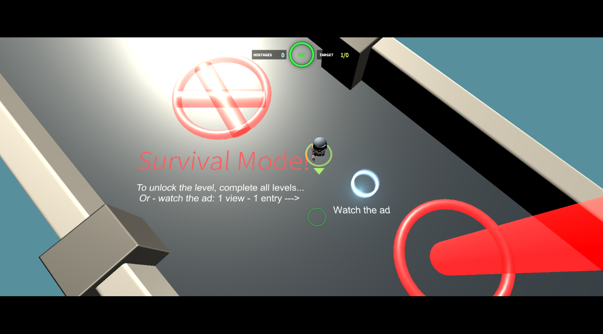
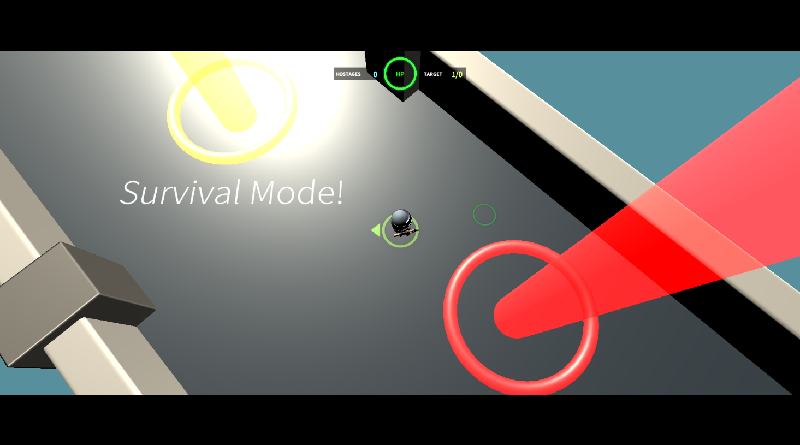
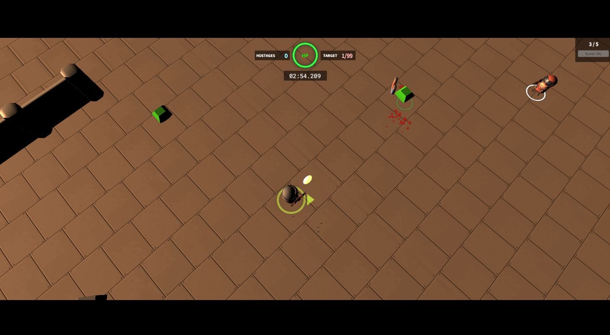
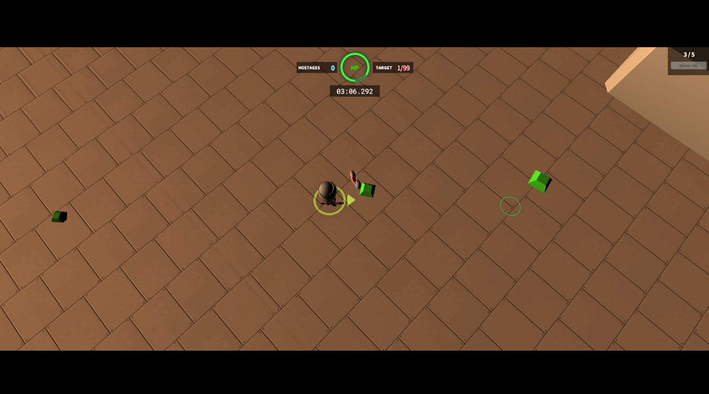
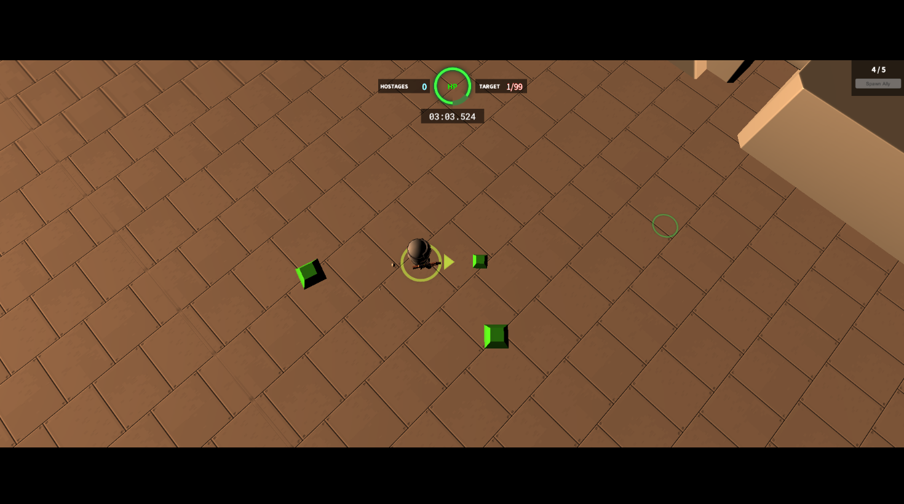
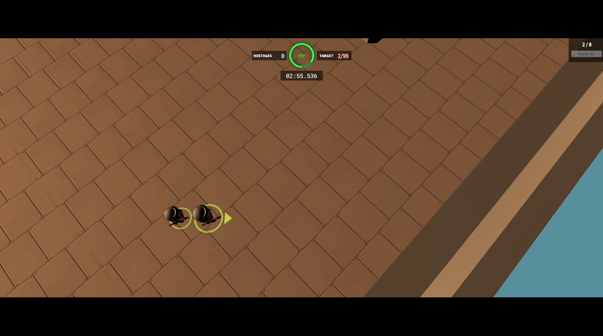
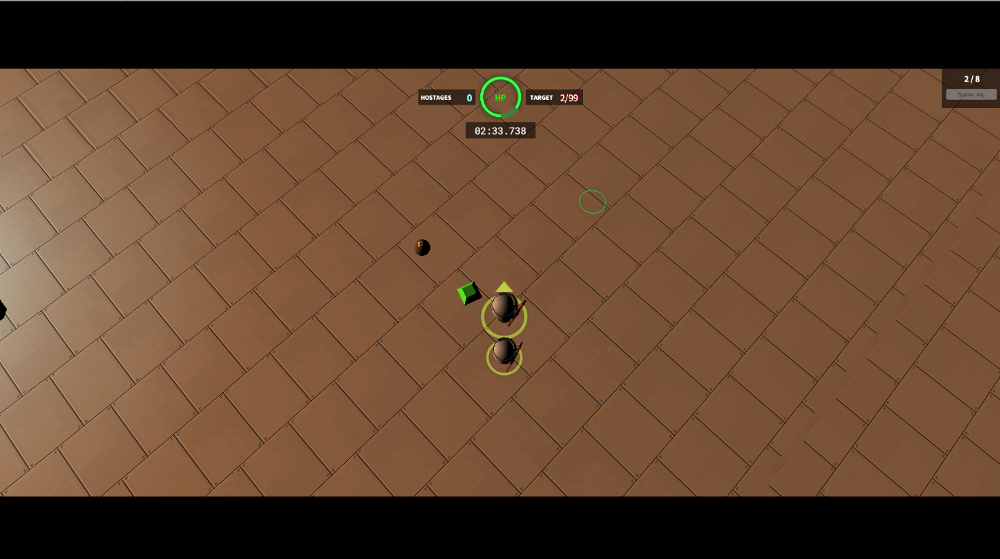
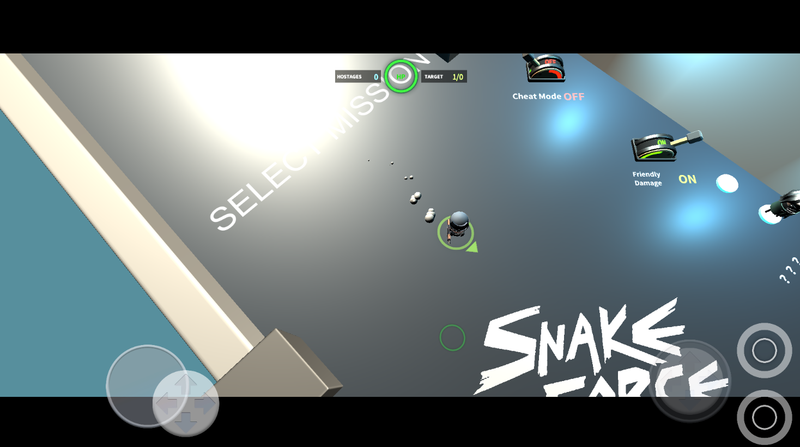

# Shake — Test Task (Unity)

Тестовое задание по созданию аркадного top-down шутера на Unity с элементами выживания, сбором ресурсов и генерацией союзников.

## 🔗 Ссылки

- 🎮 [WebGL Build (Mouse & Keyboard)](https://regleggames.itch.io/shaketesttask)
- 📱 [WebGL Build (Mobile)](https://html5.gamemonetize.com/ls2nkgzxcyg124o6v8s8t7nyu8augivi/)
- 📦 [GitHub Release v0.2](https://github.com/DjKarp/TestTask_Shake/releases/tag/v02)

## ▶️ Видео

## 📷 Скриншоты

  
  
  

  
  
  

  
  

## ⚙️ Особенности

- 🎯 Top-down стрельба по направлению курсора или джойстика
- 💎 Сбор ресурсов и бонусов (здоровье, бомбы, магнит)
- 🧠 Враги появляются волнами, прогрессивная сложность
- 🧲 Реализация притягивания предметов и взрывов по радиусу
- 👥 Возможность спавна союзников за алмазы
- 💀 Система смерти и возрождения через рекламу (GamePush)
- 📲 Поддержка мыши и мобильного ввода
- 📤 Используется объектный пулл для всех спавнов
- ⚙️ Архитектура на основе интерфейсов и событий

## ⚠️ Проблемы

На WebGL в браузере реклама GamePush **не запускается** на обеих площадках (Itch.io, GameMonetize).  
В редакторе и локальных сборках — работает корректно.

## 📁 Структура проекта

- `Assets/Scripts` — вся логика по модулям
- `Scripts/Gameplay/Items/Pickables` — алмазы и бонусы
- `Scripts/Survive` — логика и скрипты режима выживания

## ✅ Полный список требований можно посмотреть в [тестовом документе](https://docs.google.com/document/d/1dXyyLLB8LMogQLnqbV5SdniWLT1qtHn5epgNkYkWXCE/edit?tab=t.0#heading=h.ko8ruzgkf6cd).

---
